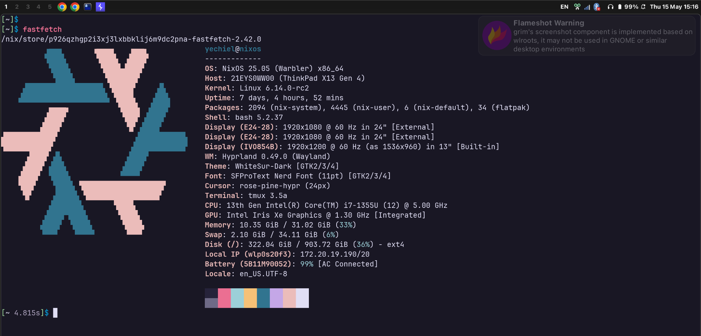

# Nixos and home-manager config



## Hyprland/NixOS/GNU/Linux

- Zen kernal
- lanzaboote for TPM backed FDE with auto unlock
- Bar: waybar
- Notification daemon: swaync
- Terminal: ghostty/kitty
- Design principle: Apple

## Installation

```sh
# login to bitwarden desktop and enable ssh agnet
SSH_AUTH_SOCK=$HOME/.bitwarden-ssh-agent.sock git clonegit@github.com:yechielw/dots.git
sudo nixos-rebuild switch --flake ./dots
#nixos-rebuild switch --flake github:yechiel/dots?dir=work \
#–-extra-experimental-features nix-command flake
```

or

```sh
nix-shell -p git bitwarden 
SSH_AUTH_SOCK=$HOME/.bitwarden-ssh-agent.sock git clonegit@github.com:yechielw/dots.git 
nixos-rebuild switch --flake ./dots
```

## post installation

### Secure boot and TPM

```bash
sudo nix run nixpkgs#sbctl create-keys

sudo nixos-rebuild switch --flake .
sudo nix run nixpkgs#sbctl verify
```

Reboot to bios, enable secure boot and enable setup mode

```bash
sudo nix run nixpkgs#sbctl enroll-keys -- --microsoft
```

Reboot

```bash
bootctl status
```

Enable TPM for all lucks partitions (usually root and SWAP)

```bash
 sudo systemd-cryptenroll --tpm2-device=auto --tpm2-pcrs=0+2+7+12 --wipe-slot=tpm2 /dev/nvme0n1p2
 sudo systemd-cryptenroll --tpm2-device=auto --tpm2-pcrs=0+2+7+12 --wipe-slot=tpm2 /dev/nvme0n1p3
```

### enable fingerprint login

```sh
fprintd-enroll $USER
```

enable atuin

```sh
atuin login
atuin sync
```
